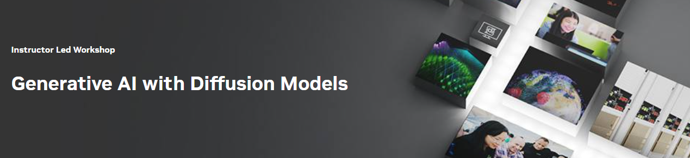

## Table of Contents
1. [Description](#description)
2. [Information](#information)
3. [Certificate](#certificate)

## Description

Thanks to improvements in computing power and scientific theory, Generative AI is more accessible than ever before. Generative AI will play a significant role across industries and will gain significant importance due to its numerous applications such as Creative Content Generation, Data Augmentation, Simulation and Planning, Anomaly Detection, Drug Discovery, and Personalized Recommendations etc. 

In this course we will take a deeper dive on denoising diffusion models, which are a popular choice for text-to-image pipelines, disrupting several industries.

## Information
The overall goals of this course were the following:

> - Build a U-Net to generate images from pure noise;
> - Improve the quality of generated images with the Denoising Diffusion process;
> - Compare Denoising Diffusion Probabilistic Models (DDPMs) with Denoising Diffusion Implicit Models (DDIMs);
> - Control the image output with context embeddings;
> - Generate images from English text-prompts using CLIP;

More detailed information and links for the course can be found on the [course website](https://www.nvidia.com/en-eu/training/instructor-led-workshops/generative-ai-with-diffusion-models/).

## Certificate

The certificate for the course can be found below:

- ["Generative AI with Diffusion Models" - NVIDIA Deep Learning Institute]() (Issued On: October 2024)
